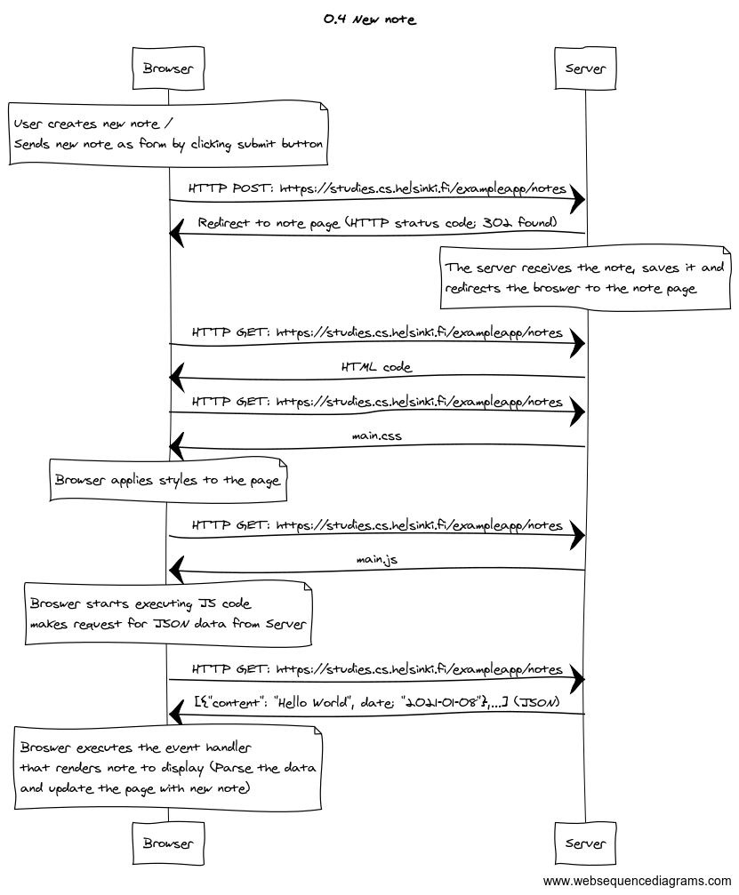
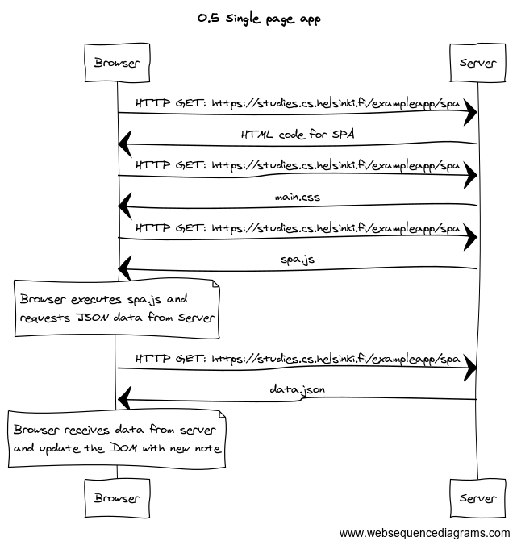
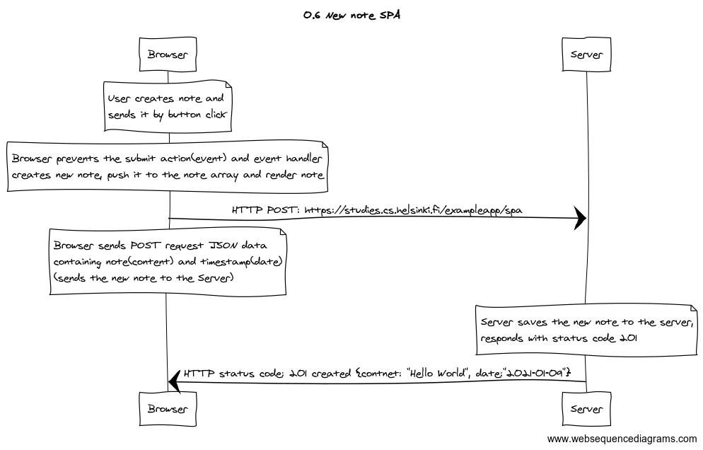

# Full Stack Open 2020
### Part 0: Fundamentals of Web Apps  

## **0.4: *new note***

## **0.5: *Single page app***

## **0.6: *New note SPA***

The diagram was made using [websequencediagrams](https://www.websequencediagrams.com/) service

[Full Stack Open - Fundamentals of Web Apps](https://fullstackopen.com/en/part0/fundamentals_of_web_apps)